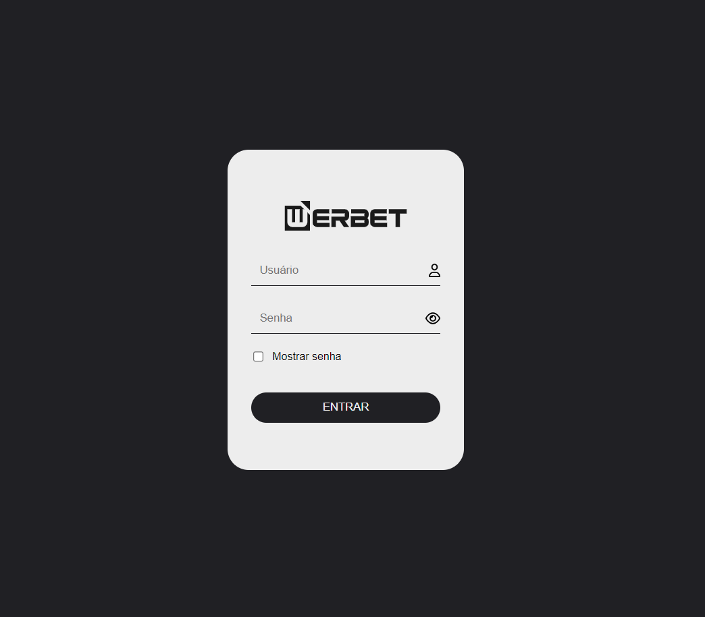

<h1 align="center"> Login (template) </h1>

<!-- 

Uma simples tela de login.
 

 -->

  <a href="#-tecnologias">Tecnologias</a>&nbsp;&nbsp;&nbsp;|&nbsp;&nbsp;&nbsp;
  <a href="#-projeto">Projeto</a>&nbsp;&nbsp;&nbsp;|&nbsp;&nbsp;&nbsp;
  <a href="#-layout">Layout</a>&nbsp;&nbsp;&nbsp;|&nbsp;&nbsp;&nbsp;
  <a href="#memo-licença">Licença</a>

  

 

  

## 🚀 Tecnologias

Esse projeto foi desenvolvido com as seguintes tecnologias:

- HTML e CSS
- JavaScript
- Git e Github
- Figma

## 💻 Projeto

Uma simples e básica tela de login.

- [Visite o projeto online](https://werbetribeiro.github.io/tela-de-login-01)

## 🔖 Layout

Projeto baseado no modelo disponibilizado [NESSE LINK](https://www.figma.com/file/GSonyCczOyOHnsQ4orzvln/9-Templates-Login-Pages-(Community)?type=design&node-id=65-246&mode=design&t=v3dtjLse03ZmKifk-0). É necessário ter conta no [Figma](https://figma.com) para acessá-lo.

## :memo: Licença

Esse projeto está sob a licença MIT.

---

Feito com ♥ por Werbet Ribeiro :wave: 